# BlockShips

A Minecraft plugin that lets players create rideable, physics-enabled ships. Build custom ships from blocks or spawn pre-built vessels, then sail the seas or take to the skies. All of this *without any client side mods or resource packs!*

Download on Modrinth: [modrinth.com/plugin/blockships](https://modrinth.com/plugin/blockships)

Other plugins that work nicely with BlockShips:
- [DynLight](https://github.com/def9a2a4/DynLight) for dynamic lighting -- without this, light emitting blocks on custom ships won't work when the ship is assembled.

[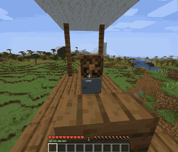](docs/assets/demo_vid.webm)


|              the prefab small spruce ship               |                 A small custom ship next to the prefab small spruce ship                 |
| :-----------------------------------------------------: | :--------------------------------------------------------------------------------------: |
| 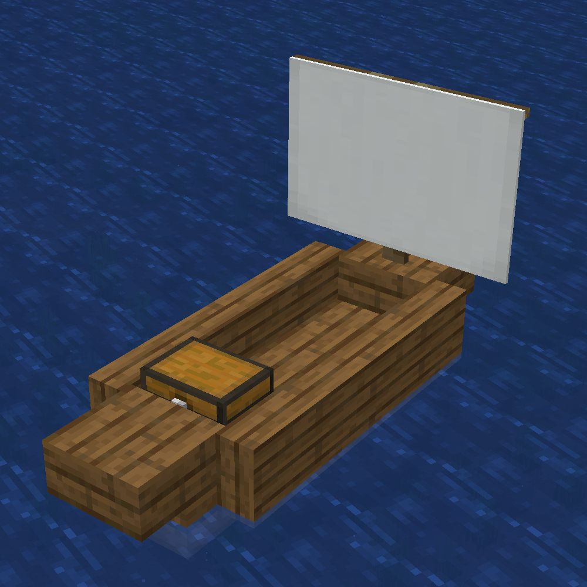 | 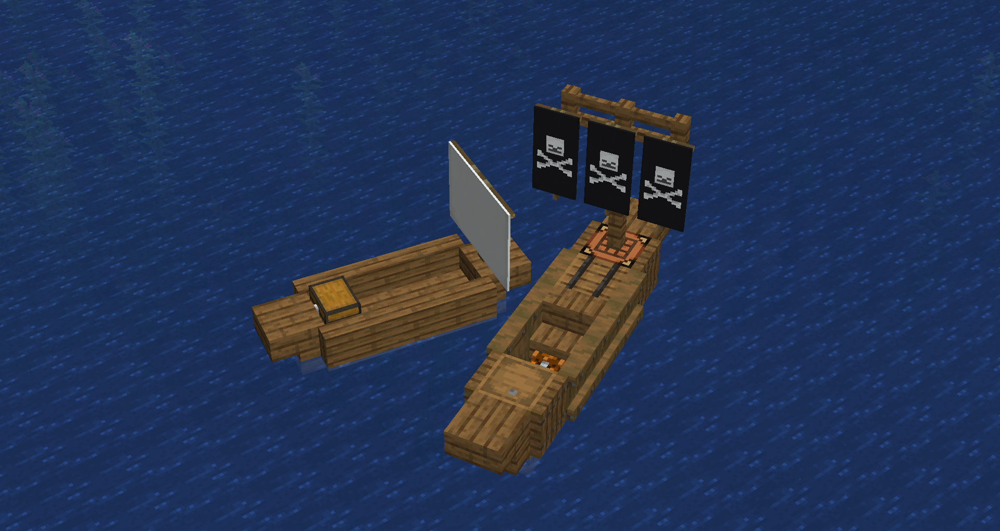 |
|                                                         |                                                                                          |

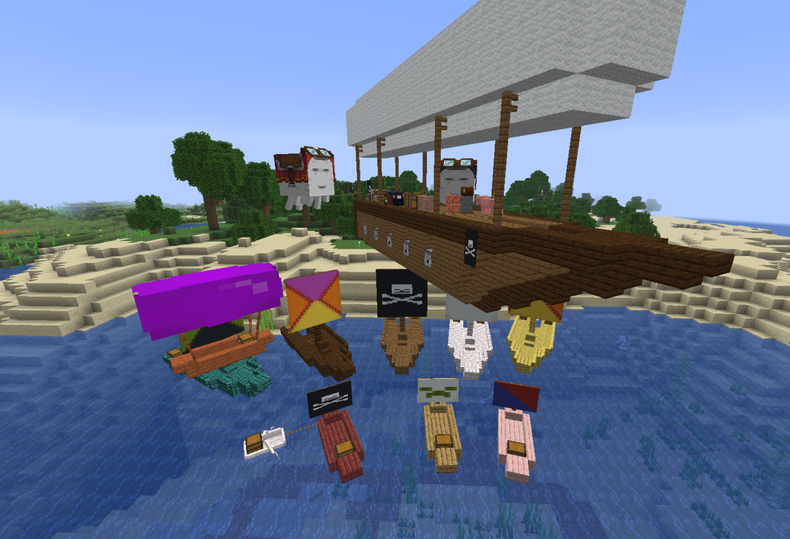


**WARNING:** THIS PROJECT IS IN ALPHA. EXPECT BUGS, MISSING FEATURES, AND BREAKING CHANGES. USE AT YOUR OWN RISK, AND BACKUP YOUR WORLD OFTEN. THE DEVELOPER IS NOT RESPONSIBLE FOR ANY DAMAGE CAUSED BY THIS PLUGIN.


# Features

Build a ship out of allowed blocks, place a Ship's wheel on it and right click, and click "assemble" in the menu. Your blocks are now a mobile ship! Depending on the density (fully configurable) of the blocks in your ship, your ship might float lower or higher in the water. Use enough "lighter than air" blocks like glowstone, and your ship will be a flying airship — or bolt on enough upward thrust and fly a heavy one. See [the flight model](docs/flight-model.md) for how lift, sail power and thrust combine.


Ships can include:

- **Functional blocks** - Crafting tables, anvils, enchanting tables work as normal. (furnaces/brewing stands don't fully yet work)
- **Storage** - Chests, barrels, dispensers, etc remain accessible
- **Seats** - any stair becomes a passenger seat you can sit on.
- **Lead points** - Anything leashed to a fence will stay tied to the ship. You can lead things to the ship while its moving. Prefab ships have a single lead point.
- **Cannons** - a dispenser with a block of obsidian behind it will shoot its contents. fire all through the ship menu, or right click on the obsidian to fire.
- **Health & damage** - Ships have health, take damage from collisions/attacks, and regenerate over time. When they run out of health, ships will attempt to place themselves back in the world.
- **Sounds & effects** - Movement and damage come with visual effects and audio.
- **Drowned Captain** - Rare drowned mobs spawn carrying ship wheels
- **Dynamic lighting** - Light-emitting blocks (glowstone, lanterns, torches, etc.) on ships emit dynamic light when [DynLight](https://github.com/def9a2a4/DynLight) is installed (optional)

## Custom Ships

1. Build a structure from allowed blocks (see [the blocks.yml section](#blocksyml) to change the list)
  - generally, wood/metal/functional blocks are allowed, while stone/dirt/other natural blocks are not
  - light-giving blocks, like glowstone, end rods, and beacons, serve as floatation aids. enough of these, and you get an airship!
  - or skip the glowstone entirely: propellers and thrusters mounted vertically, on a floor or a ceiling, will lift a heavy hull
3. Craft a "Ship Wheel"
4. Place the wheel on your structure
5. Right-click the wheel to assemble
6. Right-click again to board and steer
7. Right-click the wheel, or sneak right-click, to open menu and disassemble

## Prefab Ships

Spawn ready-to-use ships, with customizable banners/colors/wood types:

- **Small Ship** - Fast, lightweight water vessel. Two seats and a double chest.
- **Large Ship** - Larger water vessel with more health. Two double chests, many seats.
- **Small Airship** - Floats in the air with vertical controls. Also two seats and a double chest.

**Command:** `/blockships give <item>` (items: `ship_wheel`, `small_ship`, `large_ship`, `small_airship`)

## Physics System
- **Walk on your ships** - Players can walk around on deck while sailing/flying. this is still buggy!
- **Buoyancy** - Ships float based on block weight and density. this is buggy sometimes!
- **Propulsion** - Fans, propellers and thrusters add speed, turning or lift depending on which way they are mounted; a reaction wheel only ever turns, whichever way it sits
- **Lift** - A ship with less lift than it needs cannot climb and sinks, faster the more it is short by
- **Movement** - Acceleration, drag, and collision response
- **Collision detection** - Ships interact with terrain and entities (interacting with other ships is buggy)

## Controls

| Key    | Action                  |
| ------ | ----------------------- |
| W      | Move forward            |
| S      | Move backward / brake   |
| A      | Rotate left             |
| D      | Rotate right            |
| Space  | Ascend (flying ships)   |
| Sprint | Descend (flying ships)  |

On servers older than 1.21.2 the client sends no sprint signal while seated, so descending there is **S + Space** instead. The in-game help text picks the right one for your server automatically.


## Crafting Recipes

| Item                                                              | Recipe                                                   |
| :---------------------------------------------------------------- | :------------------------------------------------------- |
| **Ship Wheel**                        | 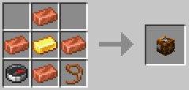       |
| **Small Ship**<br>*Wood type, banner customizable*                | 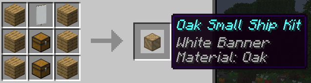       |
| **Large Ship**<br>*Wood type, banner customizable*                | 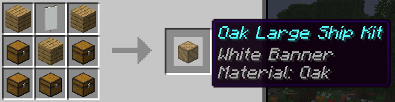       |
| **Ship Balloon**<br>*Wool color customizable*                   | 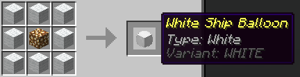   |
| **Small Airship**<br>*Wood type, balloon type customizable* | 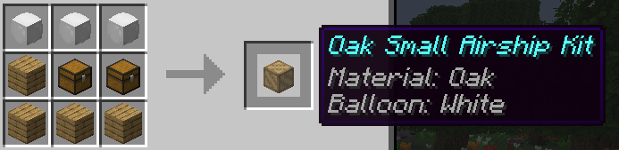 |


## Cannons

|                  Cannons Firing                   |                                         Cannon Menu                                          |
| :-----------------------------------------------: | :------------------------------------------------------------------------------------------: |
| 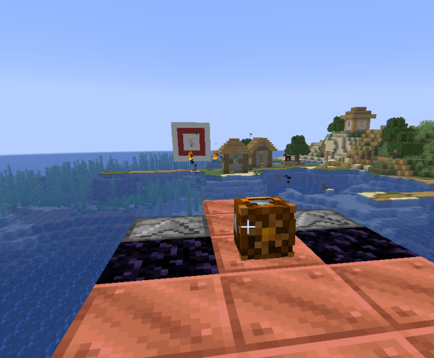 | 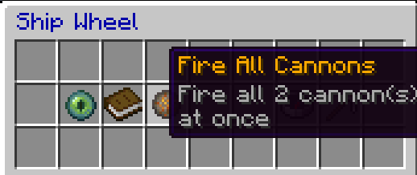 (or, right click obsidian to fire individually) |


## Commands

| Command                           | Description                                  | Permission             |
| --------------------------------- | -------------------------------------------- | ---------------------- |
| `/blockships help`                | Show help and list all commands              | -                      |
| `/blockships info`                | Show ship and wheel statistics               | -                      |
| `/blockships dismount`            | Force-dismount from a ship                   | `blockships.dismount`  |
| `/blockships reload`              | Reload configuration                         | `blockships.reload`    |
| `/blockships give <item>`         | Give yourself a ship wheel or ship kit       | `blockships.give`      |
| `/blockships recipes [player]`    | Unlock crafting recipes                      | `blockships.recipes`   |
| `/blockships forcedisassembleall` | **(DANGEROUS) Disassemble all custom ships** | `blockships.admin`     |
| `/blockships killentities`        | **(DANGEROUS) Remove all ship entities**     | `blockships.admin`     |

# Installation

1. Download the BlockShips jar file from modrinth: [modrinth.com/plugin/blockships](https://modrinth.com/plugin/blockships)
2. **IMPORTANT: Download [ProtocolLib](https://www.spigotmc.org/resources/protocollib.1997/)** if using 1.21.2 or below! ProtocolLib is no longer required as of BlockShips 0.0.16
3. Place both jars in your server's `plugins` folder
4. Restart the server

# Configuration

## config.yml

Lives at `plugins/BlockShips/config.yml` and is read from disk normally — edit it in place. Main plugin settings including:

- Ship physics (speed, acceleration, drag)
- Buoyancy values (density, strength)
- Collision settings (mass, response)
- Cannons (cooldown, whether TNT can be fired)
- Crafting recipes

## blocks.yml

Configures which blocks can be used in custom ships:

- **Weight scale** - Affects buoyancy, and how much thrust it takes to lift the ship
- **Collider** - Custom collision shapes
- **Seat/storage** - Special block behaviors

**`blocks.yml` is read from inside the jar, not from the plugin folder.** Same for `items.yml` and the prefab ship models. That way a plugin update ships current block definitions instead of being hidden by a copy you generated two releases ago. To customize it, put your edited copy in the `config/` subfolder:

```
plugins/BlockShips/config/blocks.yml
```

A file at the plugin folder root (`plugins/BlockShips/blocks.yml`) is **not read at all**. To get a copy to edit:

```sh
unzip -o BlockShips-0.0.18.jar blocks.yml -d plugins/BlockShips/config/
```

or download [`blocks.yml`](https://github.com/def9a2a4/BlockShips/blob/main/blockships/src/main/resources/blocks.yml) and save it to that path.

Your copy **replaces** the bundled one rather than merging with it, so start from the whole file and re-check it after each update — blocks added in later releases won't appear until you add them. The startup log tells you which copy is in force and warns when yours is missing entries the bundled default has.

Note that natural blocks (stone, dirt, ores) are excluded on purpose: assembly flood-fills through connected allowed blocks, so allowing them lets a docked ship swallow the terrain it is sitting on.


# Inspiration

This plugin is inspired by mods which also implement rideable ships, as well as plugins which have attempted similar functionality. I made this plugin because I realized that with the addition of display entities, it might be possible to create a better ship plugin than previously possible, but without requiring any client-side mods. No code from any of other project has been used. In particular, this plugin was inspired by:

- [Ships](https://dev.bukkit.org/projects/ships) and [Movecraft](https://github.com/APDevTeam/Movecraft) plugins
- [Archimedes Ships mod](https://www.curseforge.com/minecraft/mc-mods/archimedes-ships)
- [Eureka Ships / Valkyrian Skies mods](https://www.valkyrienskies.org/)

Although this plugin predates them, you should also check out the extremely cool Create Aeronautics Mod, as well as the similar [SimpleShips](https://github.com/jemcdevitt/SimpleShips) plugin!


# License

You are free to use this plugin only for non-commercial projects and servers. For commercial use, please contact the author for a license. For more details, see the [`LICENSE.txt`](https://raw.githubusercontent.com/def9a2a4/BlockShips/refs/heads/main/LICENSE.txt) file.


# Developing

You will need java and gradle installed. Running `make build` will compile the plugin and create a jar file in `bin/`.
